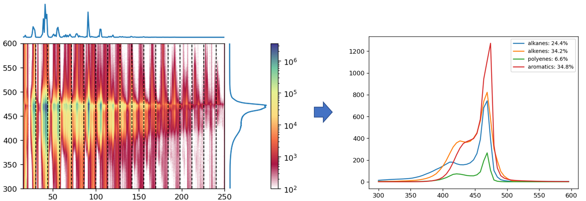

# Automated MS deconvolution for catalytic thermal decomposition of PE



## About

This repository contains the implementation of qualitative deconvolution of continuous scan mass-spectrometry data exemplified on the catalytic thermal decomposition of polyethylene (PE). The goal of this project is to provide a reproducible workflow for the MS-driven study of the dynamics of catalytic processes.

The repository contains:

* IPython notebook with deconvolution pipeline which was used for data processing:
  
  * [*process_ms.ipynb*](process_ms.ipynb): the notebook itself; 
  
  * [*functions*](functions) directory, containing functions for data processing and vizualization;
  
  * [*basis*](basis) directory, containing MS basis set prepared for this pipeline, and code with instructions for the basis preparation process;

* raw MS data and its analysis for the decomposition of PE in pure form and in the presence of two zeolites:
  
  * [examples](examples) directory, containing notebooks with results of deconvolution;
  
  * [examples/inputs](examples/inputs) directory, containing raw MS data in Shimadzu format.

## Idea

GC-MS is the gold standard for studying catalytic *operando* processes. ALthough this is a difficult and time-consuming experiment, which gives a low temporal/temperature resolution. An alternative is direct scan mass spectrometry, which is much simpler, faster, and cheaper, but only gives qualitative inferences about the process. The reason is the standard way to decipher the mass spectra of complex mixtures, that is to links key peaks and substances, e.g. m/z = 78 and benzene.

Our approach is to describe mass spectrum as a linear combination of basis compounds spectra. This approach has its weaknesses, including strong dependence of the spectrum on conditions and similarity of spectra of structurally similar compounds, which leads to high systematic errors. However, these shortcomings can be overcome by accurate selection of basis compounds, pre-calibration of the corresponding mass-spectra, and the use of several experiments with different ionization energies.

This project is a simple version of the described approach, which uses mass spectra downloaded from [NIST Chemistry WebBook](https://webbook.nist.gov/chemistry/) via [NistChemPy](https://github.com/IvanChernyshov/NistChemPy) package. It still cannot be used for a detailed interpretation of mass spectra, but it is already capable of providing quantitative information corresponding to the literature data.

As an illustration, we provide the [source](examples/inputs) and deconvoluted data of three MS scans for pure polyethylene ([PE](examples/PE.ipynb)) and in presence of HBEA ([PE_BETA](examples/PE_BETA.ipynb)) and HZSM-5 (Si/Al 30:1, [PE_SAR-30](examples/PE_SAR-30.ipynb)) zeolites. Interestingly, the deconvolution of HBEA shows that almost the only compound of the 300–350 K fraction is xylene, which was used in sample preparation.

## Installation and Usage

To run the notebook one should install Python3 with NumPy, SciPy, pandas, and RDKit packages, and IDE supporting IPython notebooks. The easiest way to do that is to use the conda package manager:

```
>> conda create -n deconv
>> conda config --add channels conda-forge
>> conda install -n deconv numpy scipy pandas rdkit jupyter
```

After that, just download this directory on your computer, activate the newly created *deconv* environment, launch IPython, and run the notebook:

```
>> conda activate deconv
>> jupyter notebook
```

To use the scripts for the basis set selection requires additional installation of [NistChemPy](https://github.com/IvanChernyshov/NistChemPy), which is a simple Python wrapper around the NIST Chemistry WebBook.

## Using in other projects

For a universal tool, this pipeline lacks two features:

* support of various MS data formats (in this work Shimadzu format was used);

* automatic basis set selection (in this work the basis set was optimized specifically for zeolite-driven decomposition of PE).

Therefore, this notebook can be used as-is for processes limited by hydrocarbons and detected by Shimadzu electron ionization spectrometers.

To adapt this pipeline to other problem, one need to:

* rewrite [*read_ms_data*](functions/composition_analysis.py) function (this shouldn't be a problem);

* collect and test a basis set suitable for the problem ([basis/csvs/basis.csv](basis/csvs/basis.csv)).

Logic behind the basis set selection and useful scripts for semi-automation of this process are given in the [basis](basis) directory.
